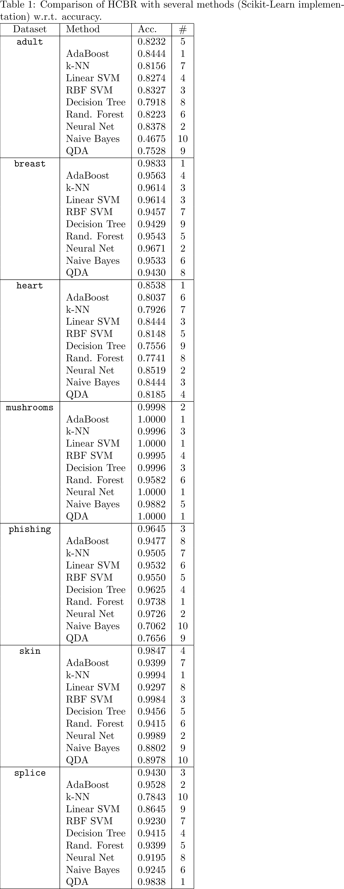
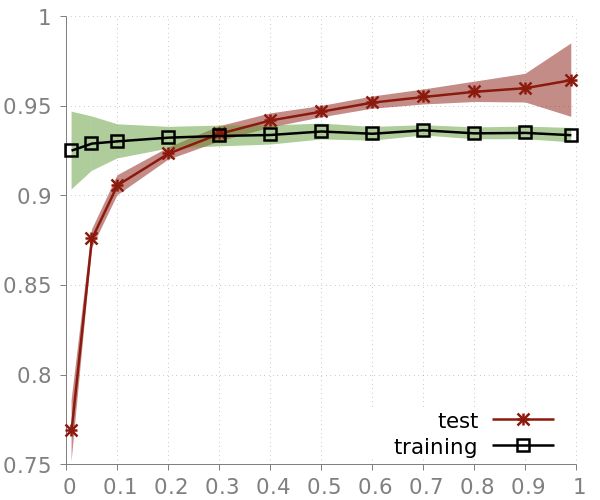
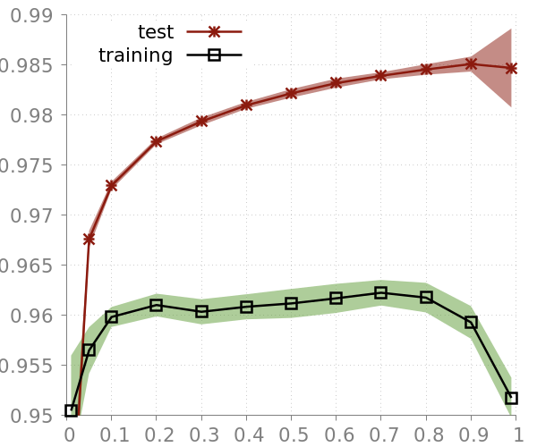
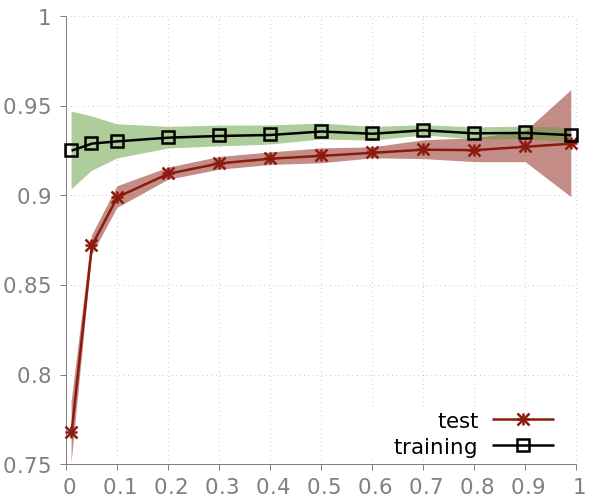
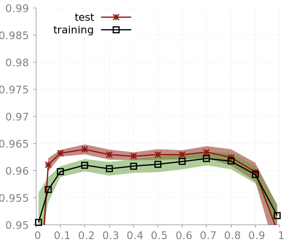
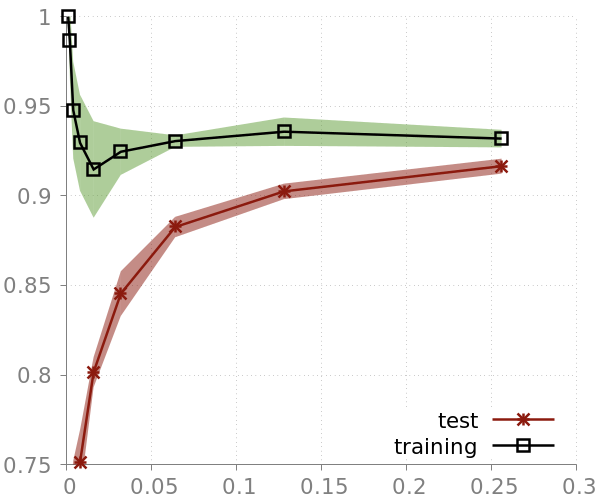
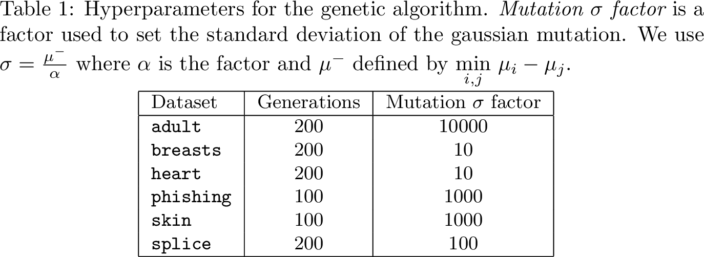
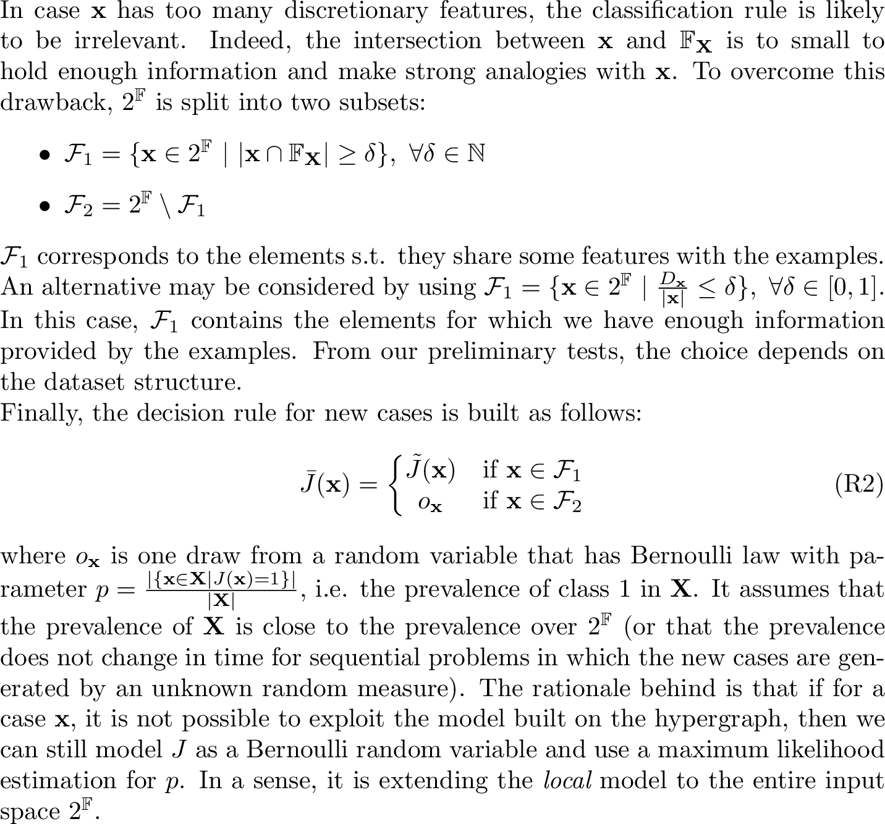

# Supplementary material description

- **Appendix A1.** [On the convergence of the training algorithm](#appendix-a1)
- **Appendix A2** [Average confusion matrix obtained with a 10-fold cross-validation.](#appendix-a2)
- **Appendix A3** [Comparison of HCBR with several methods (Scikit-Learn implementation) w.r.t.
MCC.](#appendix-a3)
- **Appendix A4** [Comparison of HCBR with several methods (Scikit-Learn implementation) w.r.t.
accuracy.](#appendix-a4)
- **Appendix A5** [Matthew Correlation Coefficient depending on the training set size.](#appendix-a5)
- **Appendix A6** [Discussion on the learning curves](#appendix-a6---discussion-on-the-learning-curves-and-the-heuristic)
- **Appendix A7** [Hyperparameters for the genetic algorithm.](#appendix-a7)
- **Appendix A8** [Model locality](#appendix-a8)

## Appendix A1

## Appendix A2

## Appendix A3

## Appendix A4

## Appendix A5

## Appendix A6 - Discussion on the learning curves and the heuristic

### Heuristic

In almost all datasets, in particular phishing and skin, many input vectors are the same, but with different output (e.g. for skin it's 583 cases i.e. 5.27% of the dataset). By definition, there is no way to distinguish between those vectors, so the best we can do is to assign the class with the highest prevalence.

In most cases the model choses itself the class with the highest prevalence among those redundant input vectors or if it does not, it has very little impact (because the prevalence is close to 0.5 and the size of the redundant vector set is small in comparison to the dataset size). 

The heuristic consists in estimating the prevalence of the set of redundant vectors in the training set, and then in bypassing the model prediction with the class associated to this prevalence. For instance, the overall prevalence of phishing is 0.5562 but the prevalence of the redundant vectors is 0.9674. About 5.27% of the test set should consists of cases already in the casebase, among which 0.9674 are of class 1. It represents the insurance of a 5.27 x 0.9674 = 5.20% of the training set correctly labeled.

The reason why the heuristic works in this case is because the prevalence of the redundant vectors set is higher than the accuracy obtained by the model (about 92.5% versus 96%). The gain corresponds exactly to this 5.20% (because without the heuristic, with the grain used by the experiment, the model uses the wrong label).

This heuristic is independant of HCBR as it could be applied to any margin-based discrimative methods (e.g. SVM also cannot discriminate between redundant points with different labels).

### Learning curve

The learning curves for phishing and skin are surprising for two reasons. First, the test accuracy is significantly higher than the training accuracy as depicted by Figure A6.1 and A6.2. 
The prediction phase on those two datasets uses the heuristic described above. For both datasets, the difference in accuracy between the two curves is much higher than the possible gain due to the heuristic.
 The learning curves for the same experiment without the heuristic are displayed on Figures A6.3 and A6.4 and it seems to explain perfectly the phenomena. 
Notice that this is specific to those two datasets that contains several redundant points with the same output. 
For instance, the heuristic is activated also on splice but as the number of redundant elements is very low w.r.t. the dataset size, the impact on the accuracy is not significant.   

    
**Figure A6.1. - Learning curves on phishing with heuristic.**
 
    
**Figure A6.2. - Learning curves on skin with heuristic.**

    
**Figure A6.3. - Learning curves on phishing without heuristic.**

    
**Figure A6.4. - Learning curves on skin without heuristic.**

    
**Figure A6.5. - Learning curves on phishing without heuristic (zoomed).**

## Appendix A7

## Appendix A8

