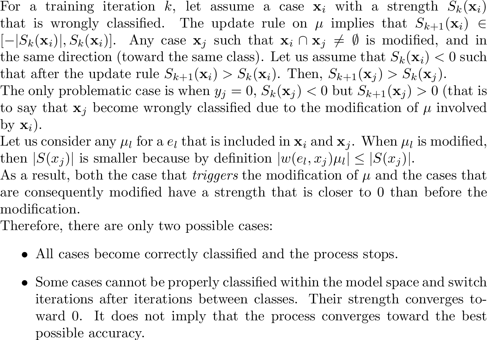
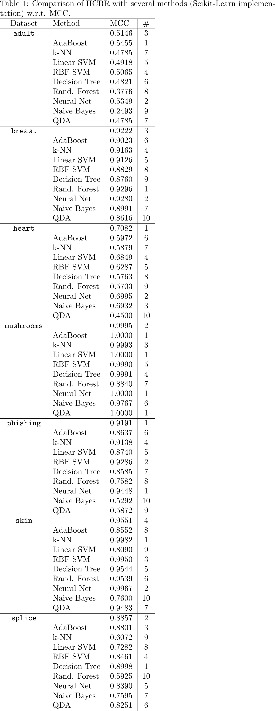
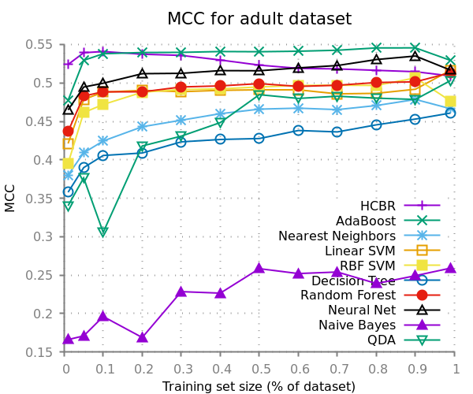
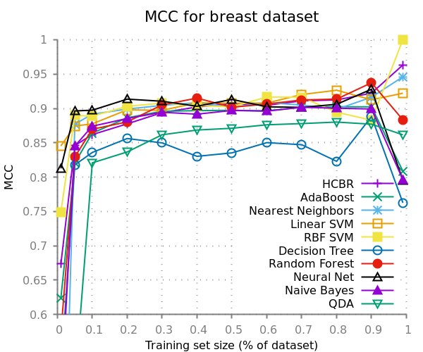
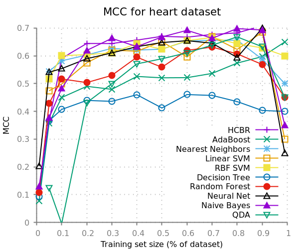
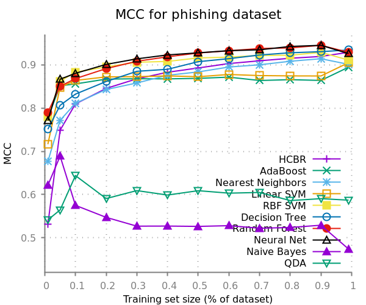
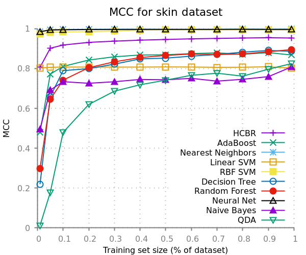
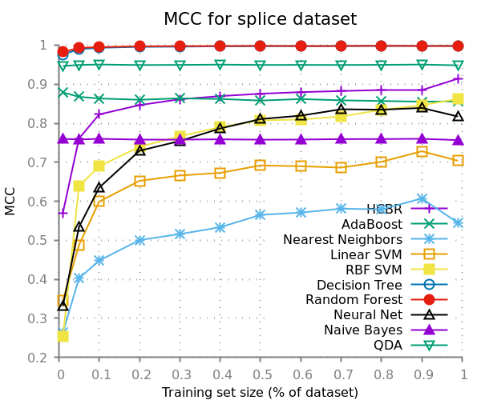
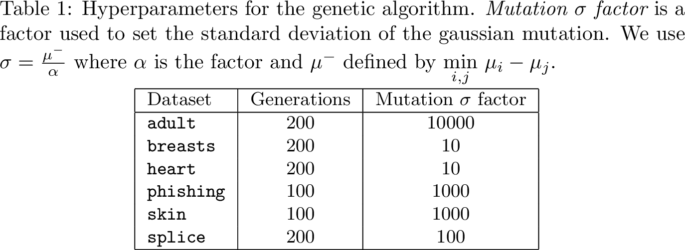

# Supplementary material description

- **A1 Appendix.** [Average confusion matrix obtained with a 10-fold cross-validation.](#appendix-a1)
- **A2 Appendix.** [Comparison of HCBR with several methods (Scikit-Learn implementation) w.r.t.
MCC.](#appendix-a2)
- **A3 Appendix.** [Comparison of HCBR with several methods (Scikit-Learn implementation) w.r.t.
accuracy.](#appendix-a3)
- **A4 Appendix.** [Matthew Correlation Coefficient depending on the training set size.](#appendix-a4)
- **A5 Appendix.** [Hyperparameters for the genetic algorithm.](#appendix-a5)

## Appendix A1

## Appendix A2

## Appendix A3

## Appendix A4

## Appendix A5

